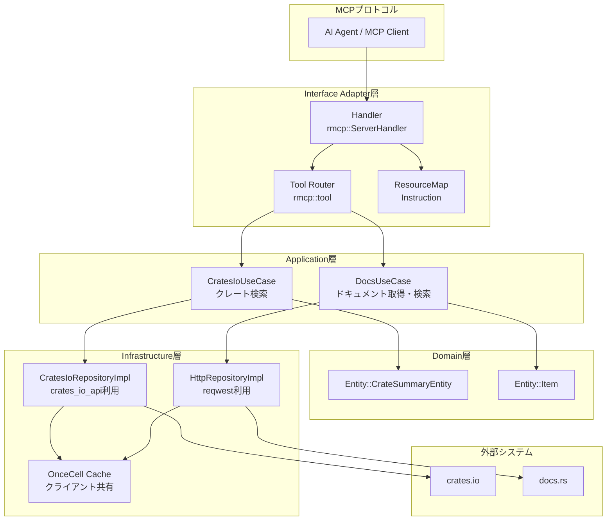
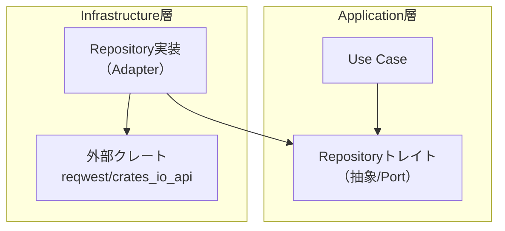
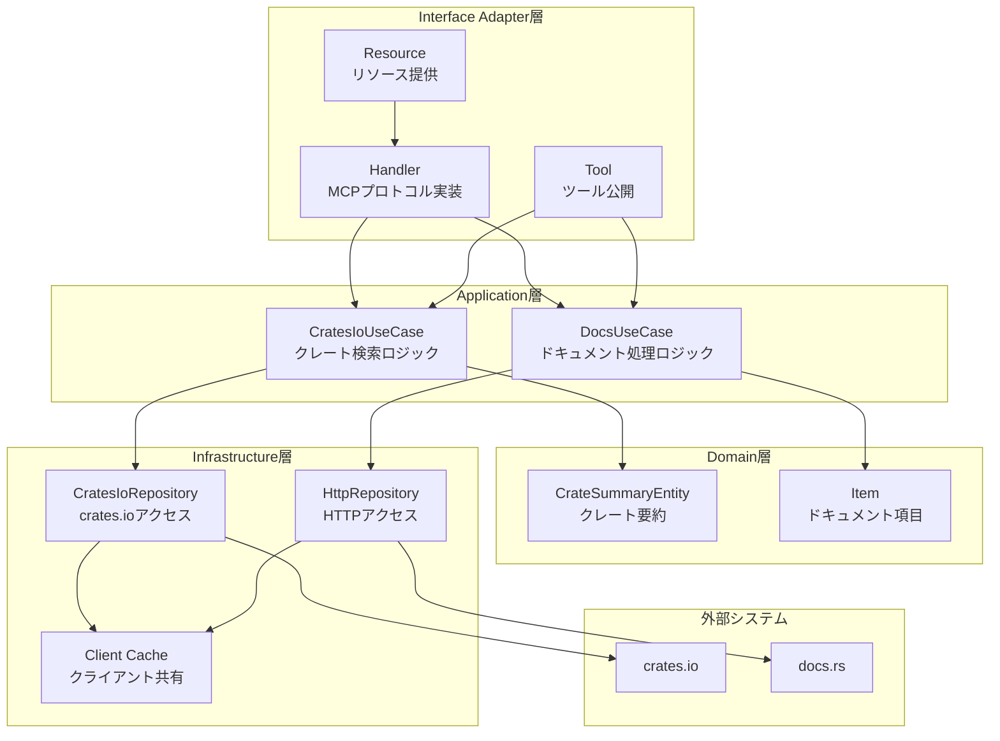
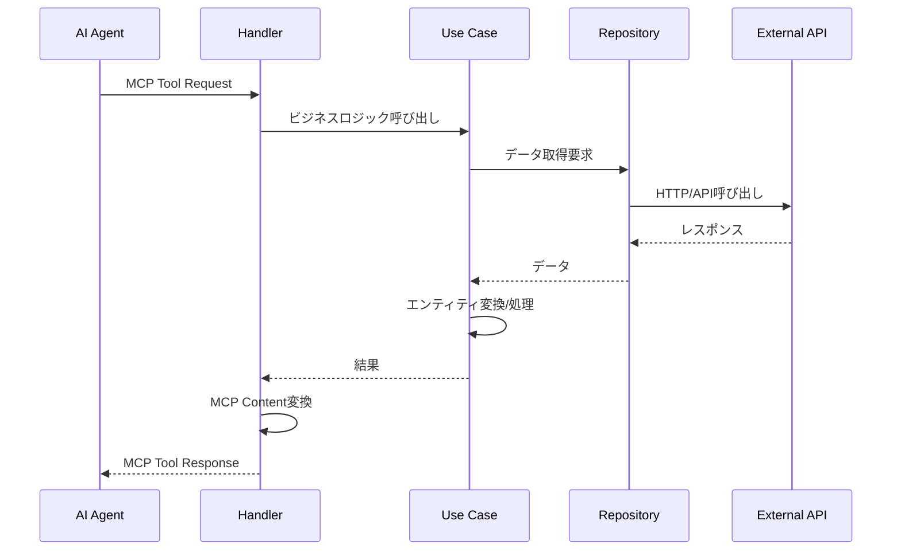
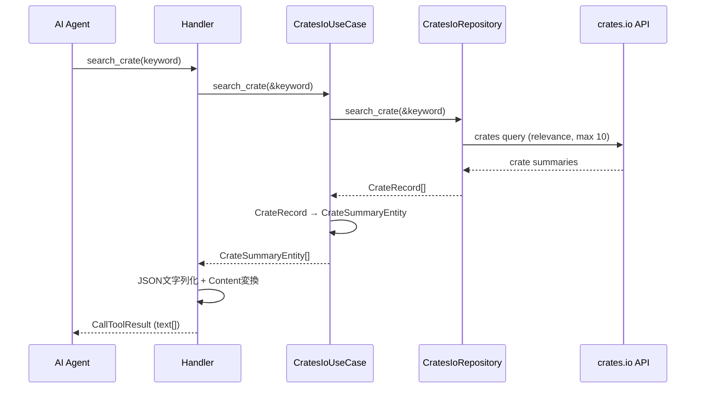
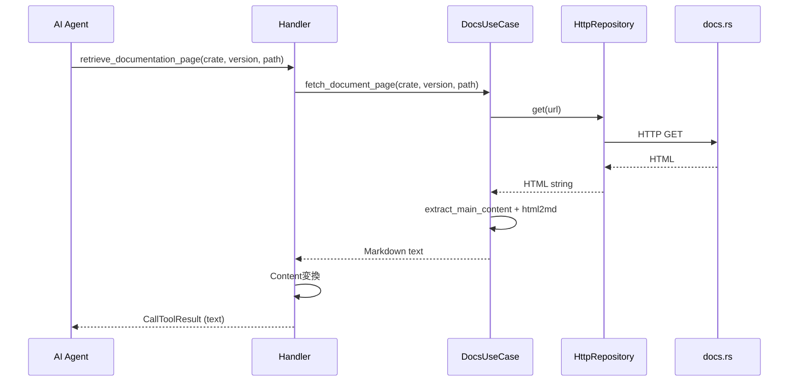
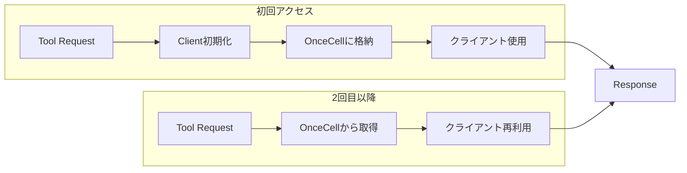

# ARCHITECTURE.md — MCP Rust Docs Server アーキテクチャ設計

本書は、MCP Rust Docs Server（実装名: mcp-rust-docs）のアーキテクチャ設計について詳細に記述します。クリーンアーキテクチャの原則を適用し、保守性・拡張性・テスト容易性を確保するための設計決定を説明します。

---

## 1. プロジェクト全体のアーキテクチャ概要

### 1.1 目的と設計思想

- **目的**
  - AIエージェントが公式の Rust 情報源である **crates.io** と **docs.rs** に対して、安全かつ再現可能な方法でアクセスするための **MCPサーバー**を提供します
  - MCPプロトコルの「Tools」と「Resources」を介して、検索・取得・あいまい検索を実行できるAPIを提供します

- **設計思想**
  - **クリーンアーキテクチャ**の原則を適用し、ドメイン（Entity）、ユースケース（Use Case）、インフラ（Repository実装）を明確に分離
  - **依存性逆転の原則（DIP）**を適用し、Use CaseがRepositoryトレイトに依存し、実装詳細はインフラ層に閉じ込める
  - **Interface Adapter**（Handler/Tool）層がMCPプロトコル（rmcp）を介して外部に公開し、Use CaseはMCP非依存を維持

### 1.2 主要コンポーネント間の関係



---

## 2. ディレクトリ構成と各ディレクトリの責務

### 2.1 src/ 以下のディレクトリ構造

```
src/
├── main.rs              # アプリケーションエントリーポイント
├── handler.rs           # MCPサーバーハンドラー
├── tool.rs              # MCPツール実装
├── resource.rs          # MCPリソース実装
├── cache.rs             # クライアントキャッシュ
├── error.rs             # 統一エラー型
├── instruction.md       # AIエージェント向け運用指示
├── entity/              # ドメインエンティティ
│   ├── mod.rs
│   ├── crates_io.rs     # crates.io関連エンティティ
│   └── docs.rs          # docs.rs関連エンティティ
├── use_case/            # アプリケーションロジック
│   ├── mod.rs
│   ├── crates_io.rs     # crates.ioユースケース
│   └── docs.rs          # docs.rsユースケース
├── repository/           # データアクセス層
│   ├── mod.rs
│   ├── crates_io.rs     # crates.ioリポジトリ
│   └── http.rs          # HTTPリポジトリ
└── record/              # データ転送オブジェクト
    ├── mod.rs
    └── crates_io.rs     # crates.ioレコード
```

### 2.2 各ディレクトリの責務

| ディレクトリ | 責務 | 主要ファイル |
|------------|------|------------|
| **entity/** | ドメインエンティティの定義。ビジネスルールを含まず、純粋なデータ構造 | `crates_io.rs`, `docs.rs` |
| **use_case/** | アプリケーションのビジネスロジック。Repositoryトレイトに依存し、具体的な処理を実装 | `crates_io.rs`, `docs.rs` |
| **repository/** | データアクセスの抽象（トレイト）と実装。外部API/HTTP通信を隠蔽 | `crates_io.rs`, `http.rs` |
| **record/** | データ転送オブジェクト。外部APIとのインターフェースを定義 | `crates_io.rs` |
| **handler.rs** | MCPプロトコルの実装。ServerInfo、Resource一覧/読み出しを担当 | - |
| **tool.rs** | MCPツールの実装。ツールの入出力スキーマと処理を定義 | - |
| **resource.rs** | MCPリソースの実装。Instructionリソースを提供 | - |
| **cache.rs** | 外部クライアントの初期化とグローバルキャッシュ | - |
| **error.rs** | 統一エラー型とMCPエラーへの変換 | - |

### 2.3 設定ファイルの目的

| 設定ファイル | 目的 |
|------------|------|
| **Cargo.toml** | プロジェクトのメタデータ、依存関係、ビルド設定 |
| **.github/** | CI/CD設定、GitHub Actionsワークフロー |
| **.vscode/** | VSCodeの開発環境設定 |
| **Justfile** | 開発タスクの自動化 |
| **package.json** | npmパッケージとしての配布設定 |

---

## 3. 外部クレート依存関係

### 3.1 主要な依存関係

| クレート | バージョン | 役割 | 選定理由 |
|---------|----------|------|---------|
| **rmcp** | 0.9.0 | MCPサーバーフレームワーク | MCPプロトコル準拠のため必須 |
| **tokio** | 1.48.0 | 非同期ランタイム | reqwest/crates_io_apiとの統合に必要 |
| **reqwest** | 0.12.24 | HTTPクライアント | docs.rsへのGETと本文取得 |
| **crates_io_api** | 0.12.0 | crates.io APIラッパー | クエリビルダやレスポンス型が整備済み |
| **scraper** | 0.24.0 | HTML解析 | CSSセレクタでmain-content抽出 |
| **fast_html2md** | 0.0.50 | HTML→Markdown変換 | docs.rs本文を読みやすい形式に整形 |
| **tantivy** | 0.25.0 | 全文検索エンジン | Itemのpathフィールドへインデックス作成 |
| **tempfile** | 3.23.0 | 一時ディレクトリ作成 | tantivyのインデックス置き場に使用 |
| **thiserror** | 2.0.17 | エラー定義 | 統一的で扱いやすいエラー型生成 |
| **serde** | 1.0.228 | シリアライズ/デシリアライズ | ツールの入出力DTO定義 |
| **serde_json** | 1.0.145 | JSON処理 | 結果のJSON文字列化 |
| **schemars** | 1.1.0 | JSONスキーマ生成 | rmcpと統合するため |
| **tracing** | 0.1.41 | ログ記録 | 可観測性向上のため |
| **async-trait** | 0.1.89 | 非同期トレイト | Repositoryトレイトで使用 |

### 3.2 依存関係の方向性



**重要**: クリーンアーキテクチャの依存性逆転（DIP）に従い、Use CaseはRepositoryトレイト（抽象/Port）に依存し、具体的な実装には依存しません。Repositoryトレイトは概念的にApplication層の境界に属し、Infrastructure層がこれを実装（Adapter）します。

### 3.3 実運用における考慮事項

#### ネットワーク信頼性
- **タイムアウト設定**: HTTPクライアントに適切なタイムアウト（推奨10秒）を設定
- **リトライ戦略**: 一時的な障害に対して指数バックオフ付きリトライを実装
- **レート制御**: crates.io/docs.rsのレートリミットを尊重し、サーバー側でも制御
- **User-Agent**: `mcp-rust-docs/{version} (+https://github.com/46ki75/mcp-rust-docs)` を明示

#### セキュリティと安全性
- **入力検証**: crate名、version、pathのフォーマットを厳密に検証
- **SSRF対策**: URL生成の安全性を確保し、許可されたドメインのみにアクセス
- **コンテンツ処理**: HTMLからMarkdownへの変換時に安全なエスケープを適用
- **ログ安全性**: 機密情報を含まないよう入力値をマスキングまたは要約化

#### 可観測性
- **ロギング方針**: request_id、tool名、入力パラメータ要約、外部呼び出し先、latency、結果件数、エラー分類を記録
- **メトリクス項目**: ツールごとの成功率、p95/p99レイテンシ、外部API呼び出し数、検索インデックスサイズ・更新時間

---

## 4. ソフトウェア構成図

### 4.1 レイヤーアーキテクチャ



### 4.2 データフロー図



---

## 5. 各ファイル・各モジュールの責務

### 5.1 Entity層

#### src/entity/crates_io.rs
- **責務**: crates.ioから取得するクレート情報のドメインモデル
- **主要構造体**: `CrateSummaryEntity`
- **依存**: serde（Serializeのみ）

#### src/entity/docs.rs
- **責務**: docs.rsから取得するドキュメント項目のドメインモデル
- **主要構造体**: `Item`
- **依存**: serde（Serializeのみ）

### 5.2 Repository層

#### src/repository/crates_io.rs
- **責務**: crates.io APIへのアクセス抽象化
- **トレイト**: `CratesIoRepository`
- **実装**: `CratesIoRepositoryImpl`
- **依存**: crates_io_api, cache

#### src/repository/http.rs
- **責務**: HTTP通信の抽象化
- **トレイト**: `HttpRepository`
- **実装**: `HttpRepositoryImpl`
- **依存**: reqwest, cache

### 5.3 Use Case層

#### src/use_case/crates_io.rs
- **責務**: クレート検索のビジネスロジック
- **主要構造体**: `CratesIoUseCase`
- **依存**: CratesIoRepository（トレイトのみ）

#### src/use_case/docs.rs
- **責務**: ドキュメント取得・処理のビジネスロジック
- **主要構造体**: `DocsUseCase`
- **依存**: HttpRepository（トレイト） + scraper, html2md, tantivy

### 5.4 Interface Adapter層

#### src/handler.rs
- **責務**: MCPサーバーのメインハンドラー
- **実装**: `rmcp::ServerHandler`
- **依存**: rmcp, use_case, resource

#### src/tool.rs
- **責務**: MCPツールの実装と公開
- **ツール**: search_crate, retrieve_documentation_*, search_documentation_items
- **依存**: rmcp, use_case

#### src/resource.rs
- **責務**: MCPリソースの実装
- **リソース**: Instruction
- **依存**: rmcp

### 5.5 共通モジュール

#### src/cache.rs
- **責務**: 外部クライアントの初期化と共有
- **キャッシュ**: crates_io_api::AsyncClient, reqwest::Client
- **依存**: tokio::sync::OnceCell

#### src/error.rs
- **責務**: 統一エラー型とMCPエラーへの変換
- **エラー種別**: InitializeClient, CratesIoApi, Http, ScraperSelectorParse, etc.
- **依存**: thiserror, rmcp

---

## 6. データフローと処理の流れ

### 6.1 ユーザーリクエストからレスポンスまでの流れ

#### search_crate の場合


#### retrieve_documentation_page の場合


### 6.2 エラーハンドリングの流れ

```mermaid
graph TD
  Error[エラー発生] --> ErrorType{エラー種別}
  
  ErrorType -->|API初期化失敗| InitError[InitializeClient]
  ErrorType -->|crates.io API失敗| CratesError[CratesIoApi]
  ErrorType -->|HTTP失敗| HttpError[Http]
  ErrorType -->|HTML解析失敗| ScraperError[ScraperSelectorParse]
  ErrorType -->|tantivy失敗| TantivyError[FuzzySearch]
  
  InitError --> IntoMCP[Into<rmcp::ErrorData>]
  CratesError --> IntoMCP
  HttpError --> IntoMCP
  ScraperError --> IntoMCP
  TantivyError --> IntoMCP
  
  IntoMCP --> MCPResponse[rmcp::ErrorData<br/>ErrorCode(1), message]
  MCPResponse --> Client[AI Agent]
```

### 6.3 キャッシュ機構の役割



- **crates_io_api::AsyncClient**: crates.io APIへのアクセスをキャッシュ
- **reqwest::Client**: HTTP通信をキャッシュ（接続プール等の最適化）
- **tokio::sync::OnceCell**: スレッド安全な初期化と共有を保証

---

## 7. 設計パターンとアーキテクチャ上の決定

### 7.1 適用されている設計パターン

#### リポジトリパターン + 依存性逆転（DIP）
```rust
// 抽象（トレイト）
#[async_trait::async_trait]
pub trait CratesIoRepository: std::fmt::Debug + Send + Sync {
    async fn search_crate(&self, keyword: &str) 
        -> Result<Vec<crate::record::crates_io::CrateRecord>, crate::error::Error>;
}

// ユースケースは抽象に依存
pub struct CratesIoUseCase {
    pub crates_io_repository: std::sync::Arc<dyn CratesIoRepository + Send + Sync>,
}

// 実装はインフラ層に
#[derive(Debug, Default)]
pub struct CratesIoRepositoryImpl {}
```

#### インターフェースアダプターパターン
- **Handler**: MCPプロトコルをアプリケーションロジックに適合
- **Tool**: MCPツール仕様をユースケースに適合
- **Resource**: MCPリソース仕様を静的コンテンツに適合

#### シングルトンパターン（キャッシュ）
```rust
static CRATE_IO_API_CLIENT: tokio::sync::OnceCell<crates_io_api::AsyncClient> = 
    tokio::sync::OnceCell::const_new();

pub async fn get_or_init_crates_io_api_client() 
    -> Result<&'static crates_io_api::AsyncClient, crate::error::Error> {
    CRATE_IO_API_CLIENT.get_or_try_init(|| async { /* 初期化処理 */ }).await
}
```

### 7.2 アーキテクチャ上の決定

#### 非同期処理の採用
- **理由**: 外部API/HTTP通信が主要な処理であり、I/O待機時間が長いため
- **実装**: tokioランタイム + async-traitで非同期トレイトをサポート
- **利点**: リソース効率の向上、スループットの改善

#### エラー処理戦略
- **統一エラー型**: crate::error::Errorに集約
- **MCPエラー変換**: Into<rmcp::ErrorData>で自動変換
- **ロギング**: tracingでエラー発生時のコンテキストを記録

#### 依存性注入の使用
- **コンストラクタ注入**: main.rsでUse CaseにRepositoryを注入
- **Arc共有**: 複数のツール呼び出しでRepositoryインスタンスを共有
- **トレイト依存**: 具体的な実装ではなく抽象に依存

### 7.3 設計上のトレードオフ

#### DocsUseCaseの依存分離
- **現状**: HTML処理・全文検索がユースケース内に実装
- **トレードオフ**: 
  - 利点: 実装の簡潔さ、処理の局所化
  - 欠点: クリーンアーキテクチャの厳密な分離からの逸脱
- **改善案**: HtmlExtractor, MarkdownConverter, TextSearchEngineのPortを切り、Adapterに分離

#### JSON文字列化のunwrap使用
- **現状**: `serde_json::to_string(&c).unwrap()` でpanicの可能性
- **トレードオフ**:
  - 利点: コードの簡潔さ
  - 欠点: エラー時のサーバー停止リスク
- **改善案**: Error::SerializationErrorを追加し、map_errで安全に処理

---

## 8. クリーンアーキテクチャ適用の評価

### 8.1 良い点

- **Entityの純粋性**: ドメインモデルは外部依存を持たず、純粋なデータ構造
- **CratesIoUseCaseのDIP遵守**: Repositoryトレイトにのみ依存し、実装から独立
- **Handler/Toolの分離**: MCPプロトコルを吸収し、Use CaseはMCP非依存
- **Repository実装の分離**: 外部クライアントへの依存がインフラ層に閉じ込められている

### 8.2 改善余地

- **DocsUseCaseの依存分離**: HTML処理・全文検索をPort/Adapterに分離
- **エラー処理の堅牢化**: panic回避、入力検証、ErrorCodeの分類
- **可観測性の向上**: ログレベル制御、メトリクス追加
- **テストカバレッジ**: エラー系、境界値、統合テストの追加

### 8.3 推奨される改善策

#### 高優先度
1. **依存関係図の修正**: DIPの矢印方向・Repositoryトレイト所在の明確化
2. **DocsUseCaseのポート分離**: HtmlExtractor/MarkdownConverter/TextSearchEngineのPort定義
3. **エラー処理の堅牢化**: unwrap排除、MCPエラー分類、入力検証
4. **ネットワーク信頼性**: タイムアウト、リトライ、レート制御、User-Agent設定

#### 中優先度
5. **ツール入出力のJSON Schema**: schemarsに基づくスキーマと具体例の掲載
6. **可観測性の指針**: tracingのフィールド方針、メトリクス項目の定義
7. **テスト戦略**: ユニット/契約/統合/スナップショットテストの追加

#### 低優先度
8. **用語集の整備**: Tool/Resource/Handler、Entity/Record/DTOの違い明記
9. **HTML構造変化への耐性**: フォールバック戦略の記載
10. **バージョン整合性**: docs.rsとcrates.ioのバージョン取り扱い方針

### 8.4 Port/Adapter分離の改善例

DocsUseCaseの外部依存を分離する場合の実装例：

```rust
// Application層（use_case/ports.rs）
#[async_trait::async_trait]
pub trait HtmlExtractorPort: Send + Sync {
    async fn extract_main(&self, html: &str) -> Result<String, crate::error::Error>;
}

pub trait MarkdownConverterPort: Send + Sync {
    fn to_markdown(&self, html_fragment: &str) -> Result<String, crate::error::Error>;
}

#[async_trait::async_trait]
pub trait TextSearchEnginePort: Send + Sync {
    async fn index_items(&self, items: &[crate::entity::docs::Item]) -> Result<(), crate::error::Error>;
    async fn search(&self, query: &str, limit: usize) -> Result<Vec<crate::entity::docs::Item>, crate::error::Error>;
}

// Infrastructure層（adapter/html_extractor.rs）
pub struct ScraperHtmlExtractor;

#[async_trait::async_trait]
impl HtmlExtractorPort for ScraperHtmlExtractor {
    async fn extract_main(&self, html: &str) -> Result<String, crate::error::Error> {
        // scraperを使用した実装
    }
}
```

### 8.5 安全なJSONシリアライズの改善例

```rust
// 現状（panicリスク）
.map(|c| rmcp::model::Content::text(serde_json::to_string(&c).unwrap()))

// 改善案（安全な処理）
.map(|c| serde_json::to_string(&c)
    .map_err(|e| crate::error::Error::SerializationError(e.to_string()))
    .map(rmcp::model::Content::text)
)
```

---

## 9. まとめ

MCP Rust Docs Serverは、クリーンアーキテクチャの原則を概ね満たす設計となっています。特にCratesIo側は模範的な実装であり、Repository/Use Case/Handlerの分離により拡張容易・テスト容易な基盤が整っています。

Docs側はユースケース内にHTMLパース・全文検索を抱えるため、厳密なクリーンアーキテクチャから見ると改善余地がありますが、現行の規模・要求では実用的で可読性の高い実装です。

### 9.1 アーキテクチャの強み

- **レイヤー分離の明確化**: Interface Adapter、Application、Domain、Infrastructureの各層の責務が明確
- **依存性逆転の適用**: Use CaseがRepositoryトレイト（抽象）に依存し、実装から独立
- **MCPプロトコルの適切な抽象化**: Handler/Tool層がMCP固有の実装を吸収
- **キャッシュ機構の効果的な利用**: OnceCellによるスレッド安全なクライアント共有

### 9.2 今後の改善ロードマップ

#### 短期（1-2ヶ月）
- **DocsUseCaseのPort/Adapter分離**: HtmlExtractor、MarkdownConverter、TextSearchEngineの抽象化
- **エラー処理の堅牢化**: unwrap排除、MCPエラー分類、入力検証の実装
- **ネットワーク信頼性向上**: タイムアウト設定、リトライ戦略、レート制御の導入

#### 中期（3-6ヶ月）
- **可観測性の強化**: 構造化ログ、メトリクス収集、分散トレーシングの導入
- **テストカバレッジ拡充**: 契約テスト、統合テスト、プロパティテストの追加
- **パフォーマンス最適化**: キャッシュ戦略の見直し、並列処理の導入

#### 長期（6ヶ月以上）
- **スケーラビリティ向上**: 水平スケール対応、負荷分散の検討
- **機能拡張**: 他のドキュメントソース対応、高度な検索機能の実装
- **セキュリティ強化**: 認証・認可機能、監査ログの実装

### 9.3 結論

本アーキテクチャは、MCPプロトコルに準拠したクリーンな構成であり、AIエージェントがRustドキュメントに安全にアクセスするための優れた基盤となっています。クリーンアーキテクチャの原則を適用することで、保守性・拡張性・テスト容易性を確保し、長期的な運用に耐え得る設計となっています。

🦀 今後の改善を段階的に適用することで、MCPサーバーとしての堅牢性・保守性がさらに向上し、AIエージェントからの安定したアクセス基盤として長期運用に耐える設計になります。