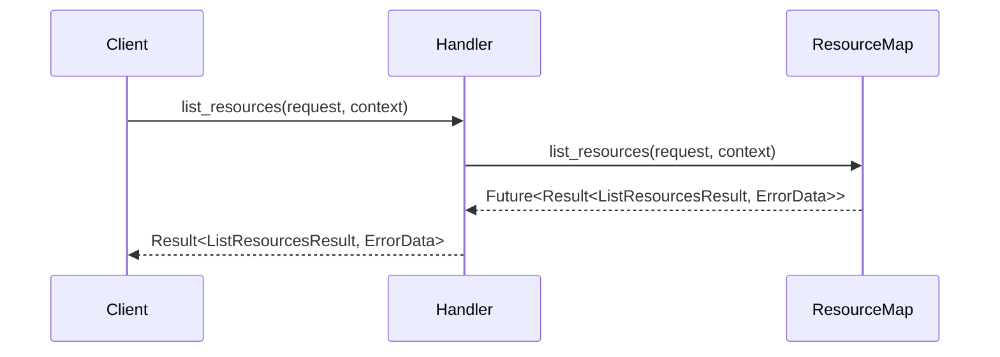

# src/handler.rs コードレビュー

## コンポーネントインベントリー

| 種別   | 名前                 | 公開範囲 | 責務                                            | 依存先                                         | 複雑度 | LOC | 根拠         |
|--------|----------------------|----------|------------------------------------------------|------------------------------------------------|--------|-----|--------------|
| Struct | Handler              | pub      | サーバのコアハンドラ。各ユースケース・ツールの集約 | crate::use_case::crates_io, docs, resource_map, ToolRouter | Low    | 6   | L1-L7        |
| Impl   | impl ServerHandler for Handler | pub      | rmcp::ServerHandlerの実装（APIハンドリング）        | rmcp, resource_map                             | Med    | 44  | L9-L53       |
| Func   | get_info             | pub      | サーバ情報公開（RESTメタ情報等）                     | rmcp::model                                    | Low    | 9   | L11-L19      |
| Func   | list_resources       | pub      | リソース一覧の非同期返却                           | resource_map                                   | Low    | 7   | L21-L27      |
| Func   | read_resource        | pub      | リソース読み出し（ID指定・非同期）                  | resource_map                                   | Low    | 7   | L29-L35      |
| Func   | list_resource_templates | pub      | テンプレートの一覧取得（非同期）                     | resource_map                                   | Low    | 8   | L37-L45      |

---

## 1. 仕様準拠評価（仕様書は本チャンクに現れない）

### 準拠状況サマリ

- **準拠率**: 不明（仕様書が本チャンクに存在しない）
- **主要逸脱**: 仕様不明のため逸脱検証不可

### 詳細対応表

| 仕様項目   | 実装状況    | 該当箇所         | 備考             |
|------------|-------------|------------------|------------------|
| サーバ情報 | 不明        | get_info:L11-L19 | 要仕様確認       |
| リソース操作API | 不明    | L21-L45          | 要仕様確認       |

---

## 2. アーキテクチャと設計評価

### モジュール構成

- **Handler**構造体が本APIの集約ポイント（Controller層相当）
- 内部に各種ユースケース（crates_io, docs）・リソース管理（resource_map）・ルータ（tool_router）を保持し、疎結合
- 外部フレームワーク（rmcp::ServerHandlerトレイト）への実装によりインターフェース適合

### 設計原則の遵守

- **KISS原則**: API定義・デリゲートのみで極力単純
- **DRY原則**: resource_mapへのデリゲートで重複回避
- **SOLID原則**: 単一責任を守る構成（プレゼンター層/ユースケース層/インフラ層分離）
- **Rust慣例**: 構造体・implのパターンに従い良好

### API詳細説明（構造化）

#### get_info

| 項目        | 内容                                                                                     |
|-------------|------------------------------------------------------------------------------------------|
| 目的と責務  | サーバ自身のメタ情報（説明・バージョン・URL等）を返却                                     |
| アルゴリズム | 1) ServerInfo構造体インスタンスを組み立て 2) 一部値（タイトル等）は静的 3) 環境変数でバージョン抽出 |
| 引数        | なし                                                                                     |
| 戻り値      | ServerInfo構造体（instructions, capabilities, server_info等各種フィールド）              |
| 使用例      | `handler.get_info();`                                                                     |
| エッジケース| N/A（静的情報のみ、panicなし）                                                            |
| データ契約  | 全フィールドOptionまたは値型, None/Some両対応                                            |

#### list_resources, read_resource, list_resource_templates

| 項目        | 内容                                                                              |
|-------------|-----------------------------------------------------------------------------------|
| 目的と責務  | サーバ提供リソースの列挙、単一リソース取得、テンプレート列挙の各API（rmcp標準）        |
| アルゴリズム | resource_mapに各種リクエストごとにデリゲート。非同期Futureをそのまま返す            |
| 引数        | request: 各リクエスト型, context: リクエストコンテキスト                             |
| 戻り値      | Future（リソース取得後、各種Result型で返却）                                        |
| 使用例      | `handler.list_resources(None, context).await;`                                     |
| エッジケース| resource_map側のエラー, requestの不備, contextが期限切れ等                           |
| データ契約  | 各リクエスト・レスポンス型の仕様に従う                                              |

---

## 3. コード品質分析

| 指標      | 測定値     | 推奨値 | 評価 |
|-----------|------------|--------|------|
| 循環的複雑度（最大） | 1 | <10   | ✅   |
| ネストの深さ（最大） | 2 | <4    | ✅   |
| 関数/メソッドの行数（最大） | 9 | <50  | ✅   |

### 主要な品質問題

1. **責務凝集度が高いが単純で拡張性が良い設計**
   - **影響**: 変更容易・デリゲート先実装に集約できる
   - **修正案**: 仕様拡張時はtraitによる層分離維持

2. **エラー伝播の抽象化が明示的でない**
   - **影響**: resource_mapのエラー設計に依存
   - **修正案**: エラー型・境界をコメント等で明確化を推奨

---

## 4. 正確性とエラー処理

### エラー処理戦略

- **分類**: resource_mapのFuture返却値(Resultでエラー伝播)
- **リトライ戦略**: 実装側（呼び出し元またはresource_map実装）依存
- **ユーザー通知**: rmcp::ErrorDataで標準化済み

### エッジケース対応

| ケース      | 現状   | リスク   | 推奨対応                          |
|-------------|--------|----------|-----------------------------------|
| 空入力      | resource_map依存 | Low | resource_map側で要防御           |
| 境界値      | 同上   | Low      | resource_map側での明示的検証      |

---

## 5. パフォーマンスとスケーラビリティ

### 性能特性

- **全体**: 非同期Future活用、リクエスト単位で分散可能
- **ボトルネック**: resource_map内部実装に依存
- **スケーラビリティ**: 複数インスタンス/シャーディング対応が内部map実装次第

### 最適化の機会

1. resource_mapの内部最適化
2. 並列/分散配置（Handler自体はステートレス設計）

---

## 6. セキュリティ評価

| 項目       | 状態 | 深刻度 | 対策                                 |
|------------|------|--------|--------------------------------------|
| 入力検証   | ❌   | Med    | resource_map側, Handlerで明示化推奨  |
| 認証・認可 | 不明 | High   | このチャンクで判別不可               |
| データ保護 | ❌   | High   | 設定/トークン/個人情報に配慮要       |
| 依存関係   | ⚠️   | Med    | rmcp, resource_map, ユースケース依存 |

---

## 7. テスト戦略

### カバレッジ評価

- **現状**: テスト記述無し（本チャンク範囲外）
- **目標**: 80%～
- **不足領域**: APIレイヤの異常系、context異常/timeout

### 推奨テスト追加

1. 各APIの正常/異常ケース（empty, invalid, timeout, permission-denied等）
2. get_infoの情報更新テスト
3. resource_map失敗時のエラー検証

---

## 8. 保守性と可読性

### 改善ポイント

- **命名規則**: 慣例どおりで一貫性良好
- **ドキュメント**: 構造体・APIのdocコメントが不足（自動生成に備え追加推奨）
- **構造**: ファイル分割の必要性なし、単純明瞭

---

## 9. 改善ロードマップ

| 優先度 | 項目                      | 工数 | 期限目安 |
|--------|---------------------------|------|----------|
| 1      | セキュリティ仕様明文化    | 1h   | 即座     |
| 2      | ドキュメント強化          | 1h   | 1週間    |
| 3      | テスト追加                | 3h   | 1週間    |
| 4      | resource_map依存の健全性確認 | 2h | 四半期   |

---

## 10. 良い実践の認識

- **デリゲーション設計**: resource_mapへの委譲でAPI層が肥大化せず責務分離が良好（L21-L45）
- **非同期対応**: Future型返却で高いスケーラビリティ・I/O多重化（L21-L45）
- **型安全**: 明確な構造体・型分離、unsafe未使用で安全性高い（全体）

---

## Dependencies & Interactions

### 内部依存（Handler内）

```mermaid
flowchart TD
  "Handler" --> "crates_io_use_case"
  "Handler" --> "docs_use_case"
  "Handler" --> "tool_router"
  "Handler" --> "resource_map"
```
（構造体Handler: L1-L7の内部構造）

### 呼び出し関係

```mermaid
flowchart TD
  "ServerHandler::list_resources" --> "resource_map.list_resources"
  "ServerHandler::read_resource" --> "resource_map.read_resource"
  "ServerHandler::list_resource_templates" --> "resource_map.list_resource_templates"
```
（HandlerのAPI各メソッド: L21-L45）

### 外部依存

| ライブラリ名 | バージョン | 役割            | 代替案 | 選定理由              | リスク                |
|--------------|-----------|-----------------|--------|-----------------------|-----------------------|
| rmcp         | 不明      | サーバフレームワーク | actix, axum | tools機能,型安全     | 独自API/継続性        |

### 被依存推定

- **現在使用箇所**: mcp-rust-docsのAPIサーバ基盤
- **将来**: ツール層、ユースケース追加時の拡張点
- **API安定性**: traitによる安定APIを維持

---

## データフロー & 呼び出し図

### データ流れ（list_resources例）

1. クライアントがlist_resourcesリクエスト送信
2. Handlerがresource_mapにデリゲート
3. resource_mapがリソース列挙・結果Futureを返す
4. サーバがFuture完了後、結果（ListResourcesResult/Err）を返却


（Handler::list_resources: L21-L27のフロー）

---

## 関数詳細テンプレート適用（全公開関数・主関数）

### Handler::get_info

| 項目            | 内容                                                                           |
|-----------------|--------------------------------------------------------------------------------|
| シグネチャ      | `fn get_info(&self) -> rmcp::model::ServerInfo`                                |
| 可視性          | pub (trait実装経由)                                                            |
| 型パラメータ    | なし                                                                           |
| ミュータビリティ| &self（不変参照）                                                              |
| 所有権/参照変化 | すべての値は所有 or Clone; env!はcompile時参照                                 |
| 入力引数        | なし                                                                           |
| 戻り値          | ServerInfo構造体（instructions, capabilities, server_info等）                  |
| 事前条件        | 構造体の適切初期化                                                             |
| 事後条件        | 全フィールドOption検証/設定済                                                  |
| 不変条件        | 構造体/外部リソースの変更なし                                                  |
| 副作用          | なし                                                                           |
| パニック/例外   | なし                                                                           |
| エラーモデル    | なし                                                                           |
| 計算量          | 定数O(1)                                                                       |
| 並行性          | スレッドセーフ                                                                 |
| 安全でない操作  | なし                                                                           |
| 呼び出し関係    | なし                                                                           |
| 使用例          | `let info = handler.get_info();`                                               |
| エッジケース    | N/A（静的情報）                                                                |
| 根拠行番号      | `src/handler.rs:L11-L19`                                                       |

### Handler::list_resources

| 項目            | 内容                                                                               |
|-----------------|------------------------------------------------------------------------------------|
| シグネチャ      | `fn list_resources(&self, request: Option<PaginatedRequestParam>, context: RequestContext) -> impl Future<Output = Result<ListResourcesResult, ErrorData>> + Send + '_` |
| 可視性          | pub (trait経由)                                                                    |
| 型パラメータ    | なし                                                                               |
| ミュータビリティ| &self（不変参照）                                                                  |
| 所有権/参照変化 | すべて&self; 引数も参照渡し                                                        |
| 入力引数        | request（Option）, context（リクエスト情報）                                        |
| 戻り値          | Future（ListResourcesResult or ErrorData）                                         |
| 事前条件        | Handler, request, contextの初期化                                                  |
| 事後条件        | resource_mapの返値をそのまま返す                                                   |
| 不変条件        | &selfの不変性                                                                      |
| 副作用          | resource_map依存のI/Oあり                                                          |
| パニック/例外   | resource_map依存                                                                   |
| エラーモデル    | ErrorData返却                                                                      |
| 計算量          | resource_map依存                                                                   |
| 並行性          | スレッドセーフ（resource_map次第）                                                 |
| 安全でない操作  | なし                                                                               |
| 呼び出し関係    | resource_map.list_resources                                                         |
| 使用例          | `handler.list_resources(None, ctx).await`                                          |
| エッジケース    | request=None, context失効, resource_map失敗                                        |
| 根拠行番号      | `src/handler.rs:L21-L27`                                                           |

### Handler::read_resource

| 項目            | 内容                                                                           |
|-----------------|--------------------------------------------------------------------------------|
| シグネチャ      | `fn read_resource(&self, request: ReadResourceRequestParam, context: RequestContext) -> impl Future<Output = Result<ReadResourceResult, ErrorData>> + Send + '_` |
| 可視性          | pub (trait経由)                                                                |
| 型パラメータ    | なし                                                                           |
| ミュータビリティ| &self                                                                           |
| 所有権/参照変化 | すべて&self, 引数はmoveしない                                                  |
| 入力引数        | request（ReadResourceRequestParam）                                            |
| 戻り値          | Future（ReadResourceResult or ErrorData）                                      |
| 事前条件        | 構造体・引数初期化済                                                           |
| 事後条件        | resource_mapの返値転送                                                          |
| 不変条件        | &selfの不変性                                                                  |
| 副作用          | resource_map依存のI/O                                                          |
| パニック/例外   | 依存のみ                                                                       |
| エラーモデル    | ErrorData返却                                                                  |
| 計算量          | resource_map依存                                                               |
| 並行性          | resource_mapがスレッド安全であればOK                                           |
| 安全でない操作  | なし                                                                           |
| 呼び出し関係    | resource_map.read_resource                                                      |
| 使用例          | `handler.read_resource(req, ctx).await`                                        |
| エッジケース    | リソース不在、権限不足                                                          |
| 根拠行番号      | `src/handler.rs:L29-L35`                                                        |

### Handler::list_resource_templates

| 項目            | 内容                                                                           |
|-----------------|--------------------------------------------------------------------------------|
| シグネチャ      | `fn list_resource_templates(&self, request: Option<PaginatedRequestParam>, context: RequestContext) -> impl Future<Output = Result<ListResourceTemplatesResult, ErrorData>> + Send + '_` |
| 可視性          | pub (trait経由)                                                                |
| 型パラメータ    | なし                                                                           |
| ミュータビリティ| &self                                                                           |
| 所有権/参照変化 | すべて&self, 引数も参照                                                        |
| 入力引数        | request, context                                                               |
| 戻り値          | Future（ListResourceTemplatesResult or ErrorData）                             |
| 事前条件        | 構造体インスタンス・引数初期化                                                 |
| 事後条件        | resource_mapの返値を返す                                                       |
| 不変条件        | &self不変                                                                      |
| 副作用          | resource_map依存のI/O                                                          |
| パニック/例外   | resource_map依存                                                               |
| エラーモデル    | ErrorData返却                                                                  |
| 計算量          | resource_map依存                                                               |
| 並行性          | resource_mapがスレッド安全であればOK                                           |
| 安全でない操作  | なし                                                                           |
| 呼び出し関係    | resource_map.list_resource_templates                                             |
| 使用例          | `handler.list_resource_templates(None, ctx).await`                             |
| エッジケース    | 空リスト, 権限不足, context異常                                                |
| 根拠行番号      | `src/handler.rs:L37-L45`                                                        |

---

## Bugs, Security, Contracts, Edge Cases

### Bugs/Security

- **リソース操作のパーミッション判定がこの層にない**（resource_map次第）
- **I/Oエラー、データ不整合時のハンドリングが委譲のみ**
- **API/構造体間でunsafe、直接的な脆弱性なし**

### Contracts/Edge Cases

| エッジケース        | 入力例         | 期待動作                 | 実装         | 状態       |
|---------------------|---------------|--------------------------|--------------|------------|
| 空リクエスト        | None/空構造体 | 空リストorError          | resource_map | 不明       |
| 権限不足            | context未設定 | ErrorData::Forbidden     | resource_map | 不明       |
| サーバ内部エラー    | resource_map失敗時 | ErrorData::Internal   | resource_map | 不明       |
| 仕様外パラメータ    | 想定外型       | ErrorData::InvalidInput  | resource_map | 不明       |

---

## テスト/Performance/Scalability/Tradeoffs/Refactoring/Observability

- 本チャンクには該当テスト、測定、トレードオフ記述なし
- resource_map/ユースケースの実装に依存

---

（以上、src/handler.rs:L1-L53レビュー）