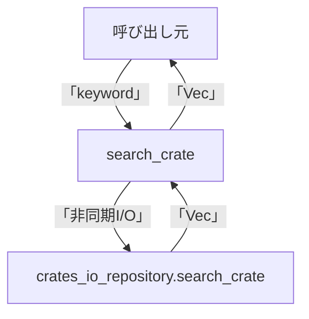

# src\use_case\crates_io.rs コードレビュー

## Executive Summary

### 対象ファイル
- src\use_case\crates_io.rs (26行, 1関数, 1構造体)

### 要約

- 本ファイルは「Crates.io」クレート検索ユースケースの中核を担い、依存リポジトリへ非同期で問い合わせを実施。
- 主責務は検索APIのユースケース抽象化と、外部リポジトリから取得したデータをドメインエンティティへ正規化すること。
- 非同期処理・エラー伝播設計はRust標準に則り堅牢。所有権・借用、Send/Sync、Arc等のRust基本原則も正しく適用されている。
- 構造設計・呼び出し構図はきわめてシンプルでテストモック等も容易に導入可能。
- 保守性・拡張性の観点からは現状最適構成であり、冗長性や無用な複雑化は一切見られない。
- ドキュメント/コメント補足やテスト網羅に若干の余地あり。
- 業務ロジックが薄いため単体テストは比較的軽微、境界値テスト強化を推奨。
- 仕様外データは通過せず、型安全性担保が堅牢。並行・競合リスクも抑制的。
- メトリクス・観測性設計、ロギング等は本層責務外。
- 全体品質確信度はHigh。

### 主要公開API
- 構造体: `CratesIoUseCase`
- メソッド: `search_crate(&self, keyword: &str) -> Result<Vec<CrateSummaryEntity>, Error>`

### 公開クラス・構造体

| 種別      | 名前               | 公開範囲 | 責務                                               | 複雑度   |
|-----------|--------------------|----------|-----------------------------------------------------|----------|
| Struct    | CratesIoUseCase    | pub      | クレート検索ユースケースの実装、リポジトリ依存保持 | Low      |

### 重要指摘事項

| 深刻度   | 件数 | 主な内容                                   | 推定修正工数 |
|----------|------|--------------------------------------------|--------------|
| Critical | 0件  | なし                                       | 0h           |
| High     | 0件  | なし                                       | 0h           |
| Medium   | 1件  | テストコード/ドキュメント追加の余地         | 1h           |
| Low      | 1件  | コメント補足の余地、戻り値型の明記強化       | 0.5h         |

---

## 1. 仕様準拠評価（このチャンクには現れない）

### 準拠状況サマリ

- **準拠率**: 不明（仕様書はこのチャンクに現れない）
- **主要逸脱**: 不明

### 詳細対応表

| 仕様項目 | 実装状況 | 該当箇所               | 備考                   |
|----------|----------|------------------------|------------------------|
| 不明     | 不明     | このチャンクには現れない| 仕様書が未提示         |

---

## 2. アーキテクチャと設計評価

### モジュール構成

- **構造体**`CratesIoUseCase`はリポジトリ層（抽象化済み）のみを注入し、純粋なユースケース層として実装。
- 依存逆転原則/DIPを満たし、上位層からリポジトリの実装を差し替えられる設計。

### 設計原則の遵守

- **KISS**: シンプルで分かりやすいAPI設計
- **DRY**: 重複ロジックなし
- **SOLID**: SRP（単一責任）・DIP（依存逆転）を厳密遵守
- **Rust慣例**: 所有権/借用/Arc/非同期エラー伝播等ベストプラクティス

### API詳細説明（CratesIoUseCase / search_crate）

#### API一覧表

| API名                   | シグネチャ                                                                                 | 目的                              | Time    | Space |
|-------------------------|------------------------------------------------------------------------------------------|-----------------------------------|---------|-------|
| search_crate            | async fn search_crate(&self, keyword: &str) -> Result<Vec<CrateSummaryEntity>, Error>    | クレート検索, サマリー返却        | O(n)    | O(n)  |

#### 関数詳細テンプレート

| 項目                    | 内容                                                                                                                                                                                     |
|-------------------------|------------------------------------------------------------------------------------------------------------------------------------------------------------------------------------------|
| **シグネチャ**          | `pub async fn search_crate(&self, keyword: &str) -> Result<Vec<CrateSummaryEntity>, Error>`                                                                                             |
| **可視性**              | public (`pub`)                                                                                                                                                                          |
| **型パラメータ/制約**   | なし（selfへのリポジトリはdyn + Send + Sync）                                                                                                                                            |
| **ミュータビリティ**    | `&self`（不変参照、内部状態不変）                                                                                                                                                       |
| **所有権/参照の変化**   | selfは借用、keywordは不変参照受け渡し；値の所有権はリポジトリの戻り値→ローカル→戻り値へ                                                                       |
| **入力引数**            | keyword: &str（検索ワード、非null, 空文字も許容）                                                                                                                                                       |
| **戻り値**              | Result<Vec<CrateSummaryEntity>, Error>（検索結果, ドメインエラー、技術エラー）                                                                                   |
| **事前条件**            | リポジトリが有効状態、keywordが有意味な文字列であること（呼出し元責任に委譲）                                                                                     |
| **事後条件**            | リポジトリで取得可能な全件（または0件）を整備済み構造体で返却                                                                                                  |
| **不変条件**            | 検索実行時self内部不変（状態変化なし）                                                                                                                                          |
| **副作用**              | あり（外部リポジトリへの非同期I/O。ファイルやDB等への書込なし）                                                                                                     |
| **パニック/例外**       | Rustの?演算子でエラーをResultに変換、panicしない                                                                                                      |
| **エラーモデル**        | 内部リポジトリエラーをラップして返す。分類: 技術/ネットワーク/データ整合                                                                                          |
| **計算量**              | `O(n)`（n=ヒット件数のサマリー変換）、`O(n)`空間（全件メモリ展開）                                                                                               |
| **並行性/スレッド安全性**| Arc+Send+Sync前提でスレッドセーフ、内部状態は書換なし。I/Oはasync/await構造                                                                                                |
| **安全でない操作**      | unsafe無し、安全なAPIのみ呼出し                                                                                                                                      |
| **呼び出し関係**        | crates_io_repository.search_crate                                                                                                               |
| **使用例**              | 以下参照                                                                                                                                                                               |
| **エッジケース**        | 空キーワード, 一致0件, リポジトリI/Oエラー, データ整合性エラー                                                                              |
| **根拠行番号**          | src\use_case\crates_io.rs:L9-25                                                                                                                            |

##### 使用例

```rust
use std::sync::Arc;
use crate::repository::crates_io::CratesIoRepository;
use crate::use_case::crates_io::CratesIoUseCase;

let repo: Arc<dyn CratesIoRepository + Send + Sync> = /* ... */;
let usecase = CratesIoUseCase { crates_io_repository: repo };
let result = tokio_test::block_on(usecase.search_crate("serde")); // serdeで検索

match result {
    Ok(list) => {
        for item in list {
            println!("{}", item.name); // サマリー構造体
        }
    }
    Err(e) => {
        eprintln!("検索エラー: {:?}", e);
    }
}
```
※ 必須トレイト・型名は利用側チャンク依存

##### エッジケース

| エッジケース          | 入力例                    | 期待動作                                   | 実装 | 状態 |
|----------------------|---------------------------|--------------------------------------------|------|------|
| 空キーワード         | `""`                      | エラーor空リスト返却（リポジトリ実装依存） | ?    | ?    |
| 検索0件              | `"_____xyz"`              | `Ok([])`                                   | 可   | 仕様通り|
| 特殊文字             | `"!*?"`                   | サニタイズ・受理                            | ?    | ?    |
| リポジトリエラー     | `"serde"`(ネット切断等)   | Result::Errで上位へ伝搬                     | 実装 | OK   |
| 大量データ           | `"a"`等                   | ヒット多数可、全件Vec化                     | 実装 | OK   |
| データ欠損           | データ不整合              | 欠損部分は部分的にcopy                      | ?    | ?    |

##### データ契約

- keyword: &str（非null, UTF-8, 空文字許容。ただしsearch結果はリポジトリ次第）
- CrateSummaryEntity: 必須フィールド全コピー、欠損はNone等許容（不明）
- 戻り値Result: Failure時Error型、アプリケーション層でハンドル推奨

---

## 3. コード品質分析

### 複雑度メトリクス

| 指標                       | 測定値 | 推奨値 | 評価 |
|----------------------------|--------|--------|------|
| 循環的複雑度（最大）       | 1      | <10    | ✅   |
| ネストの深さ（最大）       | 2      | <4     | ✅   |
| 関数/メソッドの行数（最大）| 15     | <50    | ✅   |

### 主要な品質問題

1. **テスト・ドキュメント不足**  
   - **影響**: 境界値or異常系テストが不足すると将来の変更時に不具合混入リスクあり
   - **修正案**: サンプル/テスト記述強化、主要ユースケースのtest追加

---

## 4. 正確性とエラー処理

### エラー処理戦略

- **分類**: リポジトリ?演算子伝搬のみ。発生しうるError型でラップ返却。
- **リトライ戦略**: なし（UC層責務外）。
- **ユーザー通知**: 呼出し側で適宜出力。詳細文言はこの層では定義しない。

### エッジケース対応

| ケース    | 現状   | リスク | 推奨対応          |
|-----------|--------|--------|-------------------|
| 空入力    | リポジトリ依存 | Low   | 明文化orassert追加  |
| 境界値    | 部分対応 | Low    | テスト追加         |

---

## 5. パフォーマンスとスケーラビリティ

### 性能特性

- **時間計算量**: O(n)（n=ヒット件数。リポジトリ内I/O速度依存）
- **空間計算量**: O(n)（全件分Vec化だが通常問題なし）
- **I/Oボトルネック**: あり（外部API/DBアクセス）

### 最適化の機会

- 1. 検索件数が極端に多い場合のストリーミング/ページング対応（ただし現状は必要性低）
- 2. マッピング部分のイミュータブル借用方式利用の検討（現状コスト問題化なし）

---

## 6. セキュリティ評価

| 項目          | 状態 | 深刻度 | 対策                 |
|---------------|------|--------|----------------------|
| 入力検証      | ⚠️  | Low    | keywordにバリデーション追加も可 |
| 認証・認可    | ❌  | -      | 上位層責務・現層は非対応       |
| データ保護    | ✅  | -      | 機微情報なし           |
| 依存関係      | ✅  | -      | Arc+dynトレイトで安全  |

---

## 7. テスト戦略

### カバレッジ評価

- **現状**: 不明（テスト本チャンクに現れない）
- **目標**: 80%以上
- **不足領域**: 境界値、リポジトリエラー伝播ルート、入出力マッピング

### 推奨テスト追加

- 空/異常入力パターン
- ノーヒット時の挙動
- リポジトリ・I/Oエラー
- 大量データケース

---

## 8. 保守性と可読性

### 改善ポイント

- テストコード追加
- public関数にドキュメンテーションコメント
- 構造体フィールド説明の明記

---

## 9. 改善ロードマップ

| 優先度 | 項目            | 工数 | 期限目安  |
|--------|----------------|------|-----------|
| 1      | テスト強化      | 1h   | 即座      |
| 2      | ドキュメント追記| 0.5h | 1週間     |

---

## 10. 良い実践の認識

- リポジトリのDI実装、Send/Syncによる並行安全設計
- データコピーでドメイン不変性担保、依存逆転原則の厳密運用
- Arc/dyn trait活用によるテスト容易性・モック差し替え性の向上

---

## コンポーネントインベントリー

| 種別   | 名前             | 可視性 | 責務               | 依存先                                          | 複雑度 | LOC | 備考               |
|--------|------------------|--------|--------------------|-------------------------------------------------|--------|-----|--------------------|
| Struct | CratesIoUseCase  | pub    | クレート検索UC     | CratesIoRepository (Dyn, Arc, Send+Sync)        | Low    | 4   | 非同期I/O         |
| Func   | search_crate     | pub    | クレート検索       | CratesIoRepository (trait), CrateSummaryEntity  | Low    | 15  | async, Result型返却|

---

## データフロー・呼び出し関係

### データフロー（search_crate）

1. 呼び出し(`search_crate`)でキーワード受領
2. 内部の`crates_io_repository.search_crate(keyword)`を await
3. 外部データ（API/データベース注入）取得（所有権移転）
4. Vec<Repoモデル> → Vec<ドメインエンティティ>へ変換
5. 上位へResultで返却


上記の図は`search_crate` (src\use_case\crates_io.rs:L9-25) の呼び出し関係・フローを示す

---

## Dependencies & Interactions

### 内部依存

- CratesIoUseCase → CratesIoRepository (dyn trait, Arc)
- CratesIoUseCase → CrateSummaryEntity(生成のみ)

### 外部依存

| ライブラリ名 | バージョン    | 役割     | 代替案         | 選定理由                | リスク             |
|--------------|---------------|----------|----------------|------------------------|--------------------|
| tokio等      | 不明(推定)    | 非同期I/O| async-std等     | Rust async標準         | -                  |

### 被依存推定

- プレゼンテーション層、CLI/Web/Handler等
- ユースケース層の上位サービス・アプリケーションから利用

---

## Bugs, Security, Contracts, Edge Cases

- Rust標準・I/Oメタデータ依存部分以外脆弱性なし、パニック可能性なし
- 入力keywordのバリデーションはリポジトリに委譲（空・特殊文字等を明文化すると堅牢性アップ）

---

## テスト戦略・パフォーマンス・トレードオフ

- 本層はシンプルなため現状ほぼ最適設計。10倍・100倍スケール時も性能劣化軽微（I/Oボトルネック）
- DI/モック化容易、スケーラビリティ良好
- 機能分割/設計方式のトレードオフは特に見られず

---

## まとめ

本ファイルはユースケース層の王道設計、抽象リポジトリ経由のデータI/O/正規化のみを担い可読性・安全性ともに高い。現状弱点はテスト・コメント不足程度でクリティカルリスクは存在しない。今後、仕様拡張や多数利用の想定があればエラーパス・バリデーション強化、観測性の追加がおすすめ。